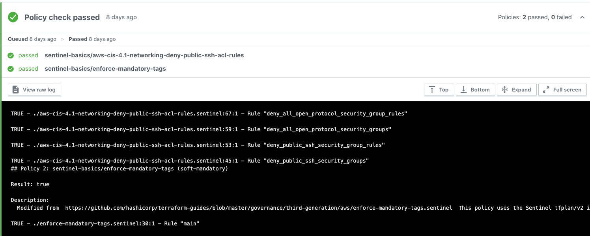

# sentinel-basics
Terraform Sentinel policies for starting out

This repo is intended to be used with Terraform Enterprise and Terraform Cloud, leveraging the [Sentinel functionality](https://www.terraform.io/docs/cloud/sentinel/index.html)
This is for AWS infrastructure, but easily can be expanded for other cloud/TF providers.  
You can see HashiCorp developed samples for other providers [here](https://github.com/hashicorp/terraform-foundational-policies-library/tree/master/cis)

To add these policies to your repo for demo/test/play purposes, you can simply add this repository as a Policy Set in your TFC organization's settings, by visiting:
https://app.terraform.io/app/$workspace_name/settings/policy-sets

If you want to use this further, fork the repo and make your own rules, or make a new repo and follow the structure of the sentinel.hcl file within this one. 

You will need to leverage an existing GitHub VCS connection, or create a new one if you don't have one to bring in public GitHub repos yet.

When adding a Policy Set, you should be mindful to select the desired "Scope of Policies", and most likely start out adding Sentinel rules to a single workspace:
- Policies enforced on all workspaces
- **Policies enforced on selected workspaces**

When this policy set is added to your workspace, it will run the rules defined in [sentinel.hcl](sentinel.hcl), which currently includes:
- **aws-cis-4.1-networking-deny-public-ssh-acl-rules**: don't allow port 22 (SSH) to ingress from 0.0.0.0/0 CIDR
- **enforce-mandatory-tags**: require ["environment", "Owner", "managed_by"] tags on your AWS 

Upon planning the workspace with the policy You'll see a new Policy section of the run detail:

